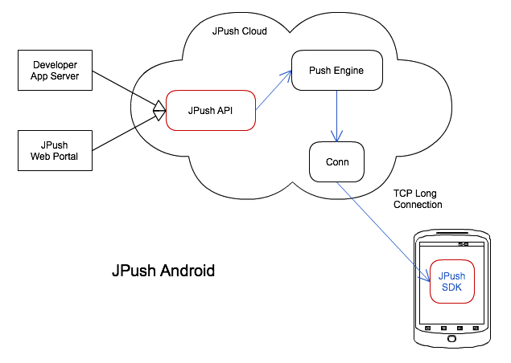

# Android SDK Overview 

+ [Android FAQ](android_faq)
+ [Android Client SDK Download](../../resources/#android-sdk)

### JPush Android

The developer integrates the JPush Android SDK into his application. The JPush Android SDK creates a long connection to the JPush Cloud, providing the app with always-on capabilities. When a developer wants to push a message to the App in a timely manner, he only needs to invoke the JPush API, or use other convenient and smart push tools to easily communicate with the user.

The red part of the figure is the contact point between JPush and App developers. On the mobile client side, the App needs to integrate the JPush SDK; on the server side, the developer calls the JPush REST API to push.

### Android SDK Service

The JPush Android SDK runs as an Android Service for a long time at the backend, creating and maintaining long connections and keeping it always online.

#### Multi-platform Support

In addition to the jar package, there is also a .so file in JPush Android SDK. The .so file needs to be compatible with the CPU platform. Which platform's CPU needs to be supported needs to include the corresponding .so compilation file for this platform.

In addition to supporting the default ARM CPU platform, the JPush SDK also provides CPU versions of the x86 and MIPs platforms SDK. Please go to [the Resource Download](../../resources/) page separately.

#### Electricity and Flow

Since JPush Android SDK uses a custom protocol and the protocol body is extremely small, the traffic consumption is very small.

In terms of battery power, the JPush Android SDK has been continuously optimized to reduce unnecessary code execution as much as possible. Moreover, long-term version upgrade and iterations are constantly being tuned to ensure that the requirements of certain network connection stability are small and power consumption is reduced.

#### Package Description

The downloadable JPush Android SDK archive contains the following sections:

+ .jar file
+ .so file
+ Configuration example of AndroidManifest.xml

The .jar, .so files have a version number suffix and need to match each other. Please remember to check the version number when you upgrade, and delete the old version.

The configuration sample of AndroidManifest.xml may change as the version is upgraded. Please pay attention to the release notes.

### Android SDK Integration

Please refer to the following documents and tutorials to integrate the Android SDK.

+ [3 Minutes Fast Demo (Android)](android_3m)
+ [Android Integration Guide](android_guide)

###  Integration into Other Platforms

[Client Integration Plugin](../client_plugins)

[0]: ../image/product_android.png
[1]: https://www.jpush.cn/downloads/sdk/android/
[2]: https://www.jpush.cn/downloads/sdk/android-with-x86
[3]: https://www.jpush.cn/downloads/sdk/android-with-mips
[4]: ../../updates
