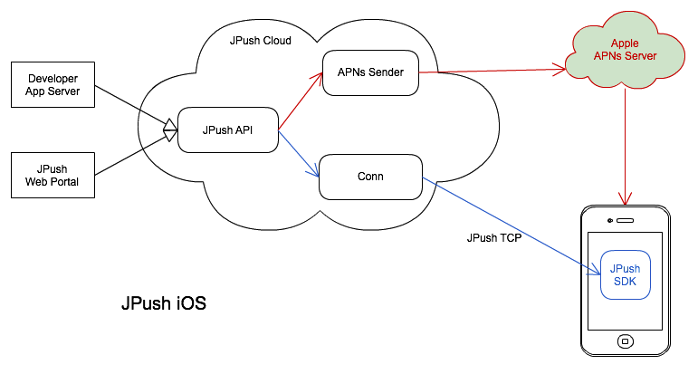

# iOS SDK Overview

- [iOS FAQ](ios_faq)
- [Download iOS Client SDK](../../resources/#ios-sdk)

## JPush iOS

As can be seen from the above figure, JPush iOS Push includes 2 parts, APNs push (proxy), and in-app messages of JPush.

The red part is the APNs push. The application of the JPush agent developer (which needs to be based on the application certificate provided by the developer) pushes to the Apple APNs server, and then pushes to iOS device.

The blue part is the in-app push part of JPush. When the app is started, the embedded JPush SDK will open a long connection to the JPush server, so JPush Server can push messages to the App.

### APNs Notification

APNs Notification: Refers to sending notifications to the Apple APNs server to reach the iOS device. The iOS system provides push notifications. The user can set, turn on or off an app's push capability through the "Settings" \>\> "Notifications" of the IOS system.

The JPush iOS SDK is not responsible for the display of APNs notifications. It only uploads Device Token information to the JPush server. Agent developers of JPush server-side push notifications to Apple APNs.

[Get Push Content of APNs](ios_api/#apns)

### In-app Messages

In-app messages: The in-app messaging function provided by the JPush iOS SDK enables you to receive push messages when your app is in the foreground. App can use this function to send messages.

This message does not go through the APNs server and is fully backed by JPush.

[Get Push Content of In-app Message](ios_api/#_24)

### APNs Notification vs. In-app Messages

If you only need to send notifications, you can ignore the processing of in-app messages. For the handling of the two types of messages, refer to the description of the API section.

JPush API v3 supports simultaneous push of APNs notifications and JPush in-app messages at the same time. This makes sense in some application scenarios.

<table>
<thead>
<tr class="header">
<th></th>
<th><strong>APNS</strong></th>
<th><strong>In-app Messages</strong></th>
</tr>
</thead>
<tbody>
<tr class="odd">
<td>Push Principle</td>
<td>It is sent by the JPush server to the APNS server and then delivered to the mobile phone.</td>
<td>It is delivered directly by JPush and will be sent every time the user pushes it. If the user is online, it will be received immediately. Otherwise save it as offline.</td>
</tr>
<tr class="even">
<td>Offline Message</td>
<td>Offline messages are handled by the APNS server cache in accordance with Apple's logic.</td>
<td>If the user is offline, JPush server will save offline messages. The default duration is one day and 5 messages will be kept offline.</td>
</tr>
<tr class="odd">
<td>Push and Certificate Environment</td>
<td>Only when App certificate and specified iOS environment match, messages can be received.</td>
<td>Custom messages are not related to the APNS certificate environment.</td>
</tr>
<tr class="even">
<td>Receiving Method</td>
<td>APNS Even exit the App, back-end and open status can receive APNS</td>
<td>The application needs to be opened and connected with JPush, then messages can be received.</td>
</tr>
<tr class="odd">
<td>Display Results</td>
<td>
If the application back-end or exit, there will be a system APNS reminder.

If the app is open, it won't show.
</td>
<td>Non-APNS is not displayed by default. Self-encoding processing can be done through the acquisition interface.</td>
</tr>
<tr class="even">
<td>Processing Function</td>
<td>Interface provided by Apple：<a href="../ios_api/#apns">didReceiveRemoteNotification</a></td>
<td>Interface provided by JPush：<a href="../ios_api/#_19">networkDidReceiveMessage</a></td>
</tr>
</tbody>
</table>

## iOS SDK Integration

Please refer to the following documents and tutorials to integrate the IOS SDK.

[IOS Integration Guide](ios_guide_new)

## iOS SDK Instructions

### iOS Version Support

-   Support iOS versions 6.0 and above

-   What you need to know when supporting iOS version 10.0 or later.

    -   When the Notification Service Extension certificate is configured, it must be noted that the BundleID cannot be the same as the Main Target. The certificate needs to be configured separately.

    -   Set the Deployment Target in the Notification Service Extension to 10.0.

    -   Delete the Target corresponding to the Notification Service Extension in XCode7 or lower.

    -   Remove the imported 'UserNotifications.framework' in XCode7 or lower.

### 

### Composition

-   Header file JPUSHService.h

-   Static library files jpush-ios-x.x.x.a,jcore-ios-x.x.x.a

### Precautions

-   [Please refer to iOS FAQ](ios_faq)

Significance of JPush APNs Notice

Push notifications on the iOS platform only has the official channel of APNs, and can be delivered at any time. General developers deploy their own application server to APNs Server.

What is the benefit of JPush iOS Push over pushing directly to APNs?

-   Reduce development and maintenance costs:

    -   Application developers do not need to develop and maintain their own push servers to interface with APNs.

    -   You do not have to maintain the update device token yourself after integrating the JPush iOS SDK.

    -   You can directly push through JPush's Web Portal, and also call JPush's HTTP protocol API to complete, thereby the development workload is greatly reduced.

-   Reduce operating costs：

    -   JPush supports pushing to Android, iOS, and WinPhone platforms at the same time, and supports a unified API and push interface.

    -   JPush provides binding mechanism of labels and alias, and provides a very subdivided user grouping method, which is very simple and intuitive to operate.

-   Provide in-app push：

    -   In addition to making APNs push easier, it also provides in-app message push. This is necessary in chat-like scenarios.

Implementation of JPush APNs

The implementation of JPush APNs can refer to an article of Jiguang Blog: [http://blog.jiguang.cn/apns/](http://blog.jiguang.cn/apns/)
